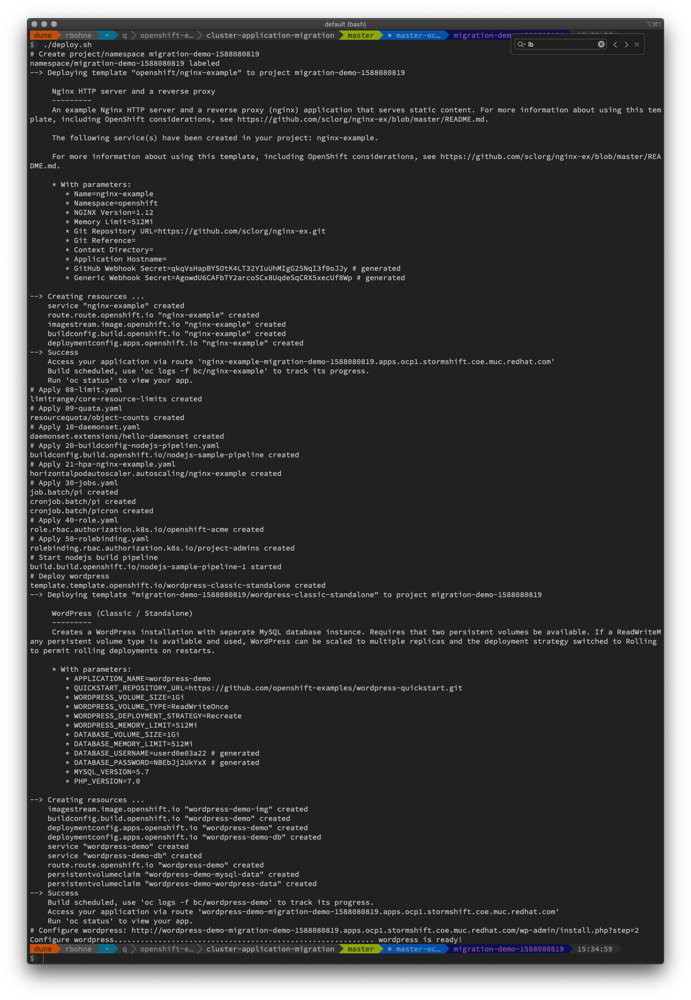
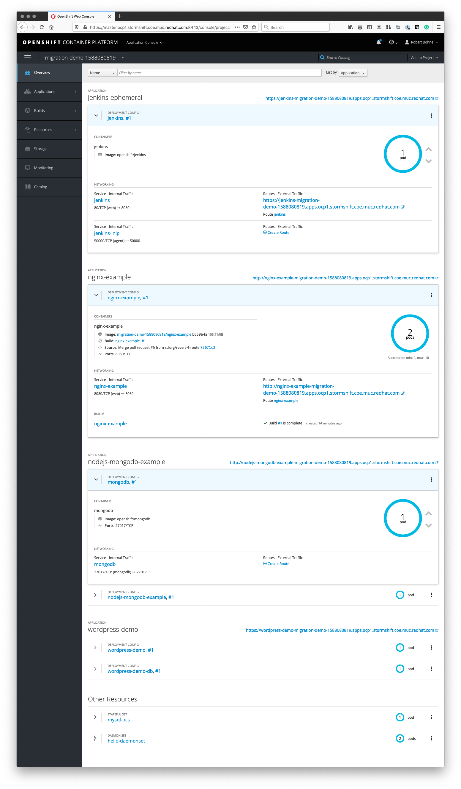
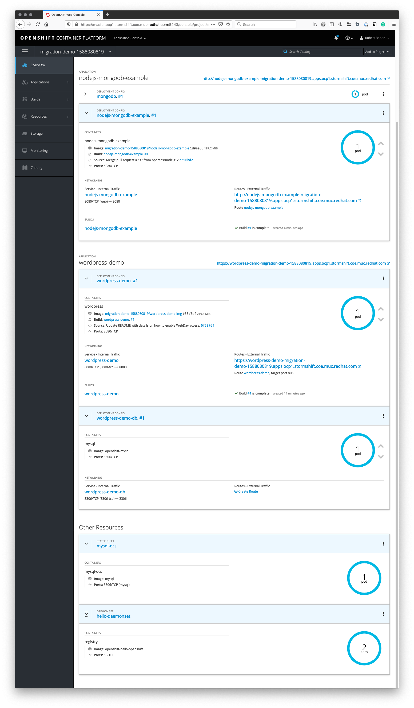

# Demo migration workload
to demonstrate the OpenShift Cluster Application Migration (CAM) tool 

## Deployment

Run 

```
./deploy.sh
```

## Delete all

```
oc delete project --wait=false -l demo=migration
```

## Optional, test CRD's

```
oc create -f - <<EOF 
apiVersion: apiextensions.k8s.io/v1beta1
kind: CustomResourceDefinition
metadata:
  name: cars.openshift.pub
spec:
  group: openshift.pub
  names:
    kind: Car
    listKind: CarList
    plural: cars
    singular: car
  scope: Namespaced
  subresources:
    status: {}
  version: v1
EOF

oc create -f - <<EOF
apiVersion: openshift.pub/v1
kind: Car
metadata:
  name: bmw
spec:
  date_of_manufacturing: "2014-07-01T00:00:00Z"
  engine: N57D30
EOF
```

## How the environment looks like



